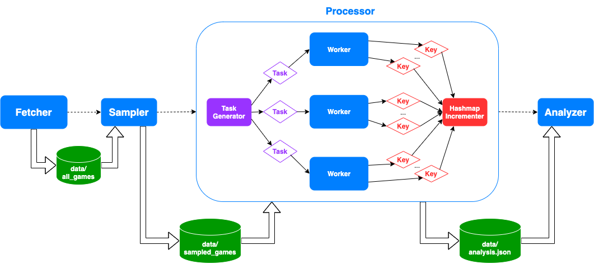

# Chess Openings Analyzer

## Table of Contents

- [General Overview](#general-overview)
- [Background](#background)
  * [Basic Gameplay](#basic-gameplay)
  * [Chess Notation and Formats](#chess-notation-and-formats)
- [App Structure](#app-structure)
  * [The Fetcher](#the-fetcher)
  * [The Sampler](#the-sampler)
  * [The Processor](#the-processor)
  * [The Analyzer](#the-analyzer)
- [Running the App](#running-the-app)
  * [Quick Run](#quick-run)
  * [Full Capabilities](#full-capabilities)
- [Analysis](#analysis)
- [Challenges](#challenges)
- [Advanced Features](#advanced-features)
- [Dependencies](#dependencies)
- [Caveats](#caveats)

## General Overview

This project helps analyze chess opening positions. It fetches over a million historical grandmaster games from the internet, processes their opening positions and ultimate outcomes, and analyzes user-provided positions against these archives.

Note that this is not intended as a chess engine; it does not (directly) evaluate the strength of chess positions. Rather, it helps users answer the question: "Given a specific chess game position, what is the percentage breakdown of game outcomes (i.e., white wins, black wins, draw) in past grandmaster games?"

```
 A B C D E F G H
8♜ ♞ ♝ ♛ ♚ ♝ ♞ ♜ 
7♟ ♟ - - ♟ ♟ ♟ ♟ 
6- - - ♟ - - - - 
5- - - - - - - - 
4- - - ♘ ♙ - - - 
3- - - - - - - - 
2♙ ♙ ♙ - - ♙ ♙ ♙ 
1♖ ♘ ♗ ♕ ♔ ♗ - ♖ 

Historically, in this position (Black to move)
==============================================
White WON:      36.6% (266 games)
Black WON:      33.2% (241 games)
DRAWN:          30.2% (219 games) 
```

## Background

### Basic Gameplay
[Chess](https://en.wikipedia.org/wiki/Chess) is a two-player strategy board game, where the player with the white pieces plays against the player with the black pieces. Each player's aim is to win by trapping the other's king (or by having their opponent resign). Therefore, each game's outcome can be a win for white, a win for black, or a draw. There are six types of pieces (pawn, bishop, knight, rook, queen, king) with their own unique movement capabilities.

*For the full set of rules, check out [this page](https://en.wikipedia.org/wiki/Chess#Rules).*

### Chess Notation and Formats

The board consists of 64 squares, broken up into an 8x8 grid. From white's perspective, the board's columns are labeled A - H (i.e., leftmost --> rightmost) and the rows are labeled 1 - 8 (i.e., closer to white --> further from white). Starting with white, each player takes a turn (called a "half" move), moving one of their pieces from one square to another. A "full" move is when both white and black have completed their turn once. One standard method for recording moves is called [algebraic notation](https://en.wikipedia.org/wiki/Algebraic_notation_(chess)).

As computers became more involved in the game of chess, [Portable Game Notation](https://en.wikipedia.org/wiki/Portable_Game_Notation) (PGN) was devised as a human and machine readable text format to describe chess games. The basic premise is that a PGN record contains metadata about the game (e.g., the event, the players' names, the date, etc.), followed by the game's moves, written in algebraic notation. The structured format makes it easy to parse. PGN files can contain a single game or multiple games, with the latter generally intended for the mass import/export of chess games into software. Check out the following examples of [a single-game PGN file](data/individual_games/game9.pgn) and [a multiple-game PGN file](data/sampled_games/London2e6.pgn).

Each unique "position" on the board can be notated with [Forsyth-Edwards Notation](https://en.wikipedia.org/wiki/Forsyth%E2%80%93Edwards_Notation) (FEN). A FEN record represents a "snapshot" and is useful for recreating specific chess game scenarios. It describes the piece placements on the board, castling rights, and a few more key pieces of information. An example can be found [here](data/individual_positions/position5.fen).

## App Structure

The app is broken up into four key parts / programs: the fetcher, the sampler, the processor, and the analyzer. They are intended to be run separately. While all of these programs may benefit from parallelization, only the processor has a sequential and parallel implementation.

See the figure below to understand the app's basic flow, along with each program's inputs and outputs. Note that, while certainly not drawn to scale, the "size" of each program's box represents how heavy it is in terms of compute need. Thus, the sampler and analyzer are relatively light, the fetcher is slightly heavier, and the processor is the heaviest of them all (by far).


### The Fetcher

The fetcher scrapes the site [PGN Mentor](https://www.pgnmentor.com/files.html) for historical grandmaster games, of which there are over a million. The site freely provides these games for download in the form of zip files. Each zip file contains only a single PGN file, with thousands of chess games in each PGN file.

The fetcher parses the webpage (looking specifically at the available files under `Openings`), downloads all of the zip files, unzips the files to uncover its PGN file, and saves the PGN files locally under [`data/all_games`](data/all_games). In total, the dataset is about 1.82 GB. Because of this large size, it has not been committed to the git repository, but it can be fetched anytime if necessary. 

### The Sampler

Because of the full dataset's large size, processing all the chess games would take too long for the purposes of this project. Therefore, the sampler's purpose is to take a subset of the games.

The sampler takes an optional sampling rate as input, cycles through all of the PGN files under [`data/all_games`](data/all_games), cycles through all of the games in each file, chooses whether to include a game in the sampled dataset, and then saves a new file with the same original name under [`data/sampled_games`](data/sampled_games). Therefore, after the sampler runs, [`data/all_games`](data/all_games) and [`data/sampled_games`](data/sampled_games) share the same file structure, but the latter is smaller by a factor of the sampling rate.

By default, the sampling rate is 0.005, or 0.5%. This yields a sampled dataset size of about 9.5MB, which is committed to the repository. The sampler runs deterministically every time, because it uses a static seed for the randomizer.

### The Processor

The processor represents the core of the project, from the perspective of building a more performant, parallelized system. Therefore, it can operate in both a sequential mode and a parallel mode. Its main goal is to preprocess the vast swath of chess games in order to make any subsequent analysis very fast.

It accomplishes this by building an index / map / table, with a clever key-value architecture. Specifically, a key represents a combination of two pieces of information: (1) a particular chess position (using FEN notation), and (2) a game outcome (white won, black won, draw). The value represents the number of past grandmaster games that ended with that outcome and that reached that position at any point in the game. Therefore, for the purposes of opening position analysis, subsequent lookups can occur in constant time. *Check out the [Caveats](#caveats) section for an explanation of where the actual implementation deviates somewhat from the basic description.*

#### Basic (Sequential) Flow

First, the index is initialized, and it is represented by a lock-free hashmap. *Check out the [Advanced Features](#advanced-features) section for an explanation of why this particular implementation is used.* The processor cycles through all the PGN files under [`data/sampled_games`](data/sampled_games) and cycles through each of the individual games in those files. If a game's outcome is uncertain (some games are never finished for various reasons), then the game is ignored, thereby ensuring that all processed games have the outcome of white winning, black winning, or a draw.

For each game, the processor cycles through each of the game's positions. Since the purpose of this project is to analyzing openings, the processor limits analysis up to a depth of 10 full moves (i.e., 20 half-moves). For each of these (up to) 20 positions, we build an index key by taking the position's FEN entry (or rather, a portion of it; see [Caveats](#caveats)) and appending the game's outcome. Then we (atomically) increment that key's value in the hashmap.

Finally, the processor converts the hashmap into JSON and save it to [`data/analysis.json`](data/analysis.json), for use in the analyzer. Here is an example snippet of the resulting analysis JSON:

```
{
    "1n1q1rk1/rp2ppbp/p1p2np1/3p1b2/2PP4/1QN1PN2/PP1BBPPP/R3K2R w KQ 1-0": 5,
    "1n1q1rk1/rp2ppbp/p1p2np1/3p1b2/2PP4/1QN1PN2/PP1BBPPP/R4RK1 b - 0-1": 1,
    "1n1qk2r/rp2ppbp/p1p2np1/3p1b2/2PP4/1QN1PN2/PP1B1PPP/R3KB1R w KQk 1/2-1/2": 2,
    "1n1qk2r/rp2ppbp/p1p2np1/3p1b2/2PP4/1QN1PN2/PP1BBPPP/R3K2R b KQk 1-0": 1,
    ...
}
```

#### Parallel Flow



The parallel version of the processor follows the same general logic as the sequential version, except that it uses a fan-out/fan-in pattern of generating "tasks" and collecting "results" using `go` channels.

Each task simply contains the path of a PGN file under [`data/sampled_games`](data/sampled_games), and these tasks are placed into a task channel. As noted before, each of these files contain thousands of games, and in total, there are 232 of these files.

The processor then spawns a number of workers based on the provided thread count. Each worker continuously pulls tasks from the task channel (as long as it is open) and is fully responsible for processing all the games in its task's file. Similar to the logic described in the sequential version, the worker cycles through all of the file's games and all of the games' positions (up to a depth of 20 half-moves). For each of these positions, the worker generates a result object that contains a single data point: a position + outcome key. It then places that result object into its own result stream. (This logic helps explain why the image shows each worker sending multiple key results for each task.)

Elsewhere, a thread multiplexes results coming from all of the workers' result streams. Another thread pulls each mulitplexed result object and atomically increments the value of the result's position + outcome key. Finally, when there are no more files to process, the processor converts the hashmap into JSON and save it to [`data/analysis.json`](data/analysis.json), for use in the analyzer. 

### The Analyzer

Compared to the processor, the analyzer is quite simple. It essentially takes a chess position as input and provides statistics about past outcomes in grandmaster games.

The analyzer accepts as input either a FEN file (a chess position on its own) or a single-game PGN file (and uses the game's last position). It then builds the three possible position + outcome keys. Then, it parses the [`data/analysis.json`](data/analysis.json) file into a simple `go` map, looks up the number of past games for each of the three position + outcome scenarios, calculates the relevant statistics, and outputs the game's position along with the statistics. *To be precise, the total number of games that ever reached a certain position is calculated by adding up the individual count values of the three position + outcome keys. With this number, individual percentages can be calculated.*

Some sample positions and games can be found under [`data/individual_positions`](data/individual_positions) and [`data/individual_games`](data/individual_games), respectively. Here is some example output from the analyzer:
```
 A B C D E F G H
8♜ ♞ ♝ ♛ ♚ ♝ ♞ ♜ 
7♟ ♟ - - ♟ ♟ ♟ ♟ 
6- - - ♟ - - - - 
5- - - - - - - - 
4- - - ♘ ♙ - - - 
3- - - - - - - - 
2♙ ♙ ♙ - - ♙ ♙ ♙ 
1♖ ♘ ♗ ♕ ♔ ♗ - ♖ 

Historically, in this position (Black to move)
==============================================
White WON:      36.6% (266 games)
Black WON:      33.2% (241 games)
DRAWN:          30.2% (219 games) 
```

## Running the App

This project has a top-level `go` program called `app` that takes as arguments the `fetch` / `sample` / `process` / `analyze` commands (matching the programs described above), along with their inputs. Before performing a quick run, it is recommended that you go through the [Full Capabilities](#full-capabilities) section to understand the programs' requirements. *Note that when executing any of these scripts, you may first see some output that installs the necessary dependencies.*

### Quick Run

To run the processor program sequentially, make sure that you are in `src/` and execute:
```
go run chess-openings/app process
```

To run the processor program in parallel with 8 threads, make sure that you are in `src/` and execute:
```
go run chess-openings/app process 8
```

The benchmarking / speedup testing script requires `python3.7` and `matplotlib`. To run it (with only 1 execution per configuration instead of 20), make sure that you are inside `proj3/` and run:
```
python3.7 testing/benchmark.py 1
```

### Full Capabilities

The `app` package is the main execution point for the `chess-openings` module defined under `src/`. Therefore, to run any of the programs below, make sure that you are inside `src/`.

If you run `go run chess-openings/app help`, you will get the following usage menu:
```
Usage: app <command> [...arguments]

    app help
        Shows this usage menu.

    app fetch
        Fetches all the chess games from www.pgnmentor.com (about 1.8 GB of data)
        and saves them to 'data/all_games'.

    app sample [sampling rate]
        Samples the fetched chess game files based on the provided sampling rate
        and saves them to 'data/sampled_games'.

        [sampling rate] is an optional argument representing the sampling rate.
            If not provided, the program defaults to a sampling rate of 0.5%.

            If provided and valid (between 0 and 1 inclusive), the program uses that value.

    app process [number of workers]
        Builds an index of the saved chess games and saves the analysis to 'data/analysis.json'.
        It can operate in either sequential mode or parallel mode.

        [number of workers] is an optional argument representing the program's parallelism.
            If not provided, the program defaults to operating in sequential mode.

            If provided, the program operates in parallel mode, limiting the maximum number of
            processors using runtime.GOMAXPROCS(...) and spawning that number of workers.

    app analyze <input type> <input file>
        Analyzes the provided chess game position using the calculated index.

        <input type> is a required argument that can either be 'pgn' or 'fen'.
        <input file> is a required argument that represents a chess game position file matching <input type>.
```

In order to fetch all 1.82 GB of chess game PGN files, execute:
```
go run chess-openings/app fetch
```

The `data/sampled_games` directory should already exist, but if you want a custom sample, you must make sure to `fetch` first. In order to sample 0.5% of the full games dataset (the default), execute:
```
go run chess-openings/app sample
```

In order to sample 1% of those games, execute:
```
go run chess-openings/app sample 0.01
```

In order to process the sampled games sequentially (the default), execute:
```
go run chess-openings/app process
```

In order to process the sampled games in parallel with 6 threads, execute:
```
go run chess-openings/app process 6
```

In order to analyze a (sample) FEN file, execute:
```
go run chess-openings/app analyze fen ../data/individual_positions/position4.fen
```

In order to analyze a (sample) PGN file, execute:
```
go run chess-openings/app analyze pgn ../data/individual_games/game7.pgn
```

## Analysis

Primary benchmark testing was run on a 2019 MacBook Pro, 2.4 GHz 8-Core Intel Core i9 with 32GB of 2400 MHz DDR4 memory. General testing was also conducted on the linux cluster machines to confirm compatibility. The `processor` was tested with three different granularities of the sampled dataset: 0.05%, 0.1%, and 0.5%. Respectively, the three figures below describe the speedups via Amdahl’s Law when using parallel mode (with thread counts 1, 2, 4, 6, and 8) over sequential mode.


We can see that in every case, there is always a speedup. As expected, the speedup is monotonically increasing as we increase the number of threads from 1 to 8, though we might have seen it plateau or dip if we had exceeded the logical number of processors on the test machine. One interesting implication of this graph, though, is that the speedup does not reach anywhere near the maximum possible speedup, according to Amdahl’s Law. One reason for this may be the specific proportion of parallelized code, and another is the presence of bottlenecks and hotspots, even in the parallel implementation. 

In the sequential version, the potential bottlenecks are (1) traversing the dataset directory, (2) opening the input PGN files, (3) performing the processing of each file's games, and (4) performing the atomic increment on the hashmap's values. Ultimately, each of these steps block each other before the next step can take place. The hotspot is processing each file's thousands of games and incrementing the hashmap values.

In the parallel version, the task generation occurs independently of the remaining steps, so it’s no longer a bottleneck. Moreover, the PGN file opening occurs independently because each worker is responsible for opening its own PGN file; unfortunately, it’s still a bottleneck for the actual games processing step because it must occur first. Thankfully, the hotspot of processing the PGN files has been parallelized across workers. The heaviest step, of course, is processing each game and going through its moves; this is parallelized across the file level, but not on the individual game level. The atomic incrementing has been separated into a separate, single thread that receives the keys and performs the operation, so it's no longer a bottleneck, but it has not been parallelized. Overall, the usage of channels throughout this paradigm introduces a sequential aspect to pushing/pulling tasks and pushing/pulling results.

As we can see from the speedup values (in the three cases of dataset granularity), the larger the dataset, the less speedup the program actually provided. For example, at 8 threads, the speedup for the smallest set was about 4.0x, for the middle set was about 3.3x, and for the largest set was only 2.0x. One aspect of it is the lack of parallelism of working with bigger files with thousands of games vs. individual games (see the [Challenges](#challenges) section). Another aspect is the usage of [the chess game decoding package](https://github.com/notnil/chess), and the amount of time it takes to decode/parse the games. As the dataset size increased, this started to taking up a larger percentage of the program time. See the profiler outputs of [the sequential version](testing/profiling/profile_sequential.pdf), [the parallel version with 2 threads](testing/profiling/profile_parallel2.pdf), and [the parallel version with 8 threads](testing/profiling/profile_parallel8.pdf) for a more detailed breakdown of this. The hashmap incrementing and lookups started to take up a smaller percentage overall, indicating that synchronization may not be the bottleneck here. Instead, this indicates the need for a more performant approach to parsing chess games, such as a simpler game reading and/or a more parallelized approach to splitting the games pre-decoding. On the other hand, if the long-term purpose of this application is to expand analysis capability, all of that package's decoding/validation power may be necessary.

## Challenges

One big challenge was determining what problem to actually solve. There are lots of ways to look at the problem of analyzing chess games and lots of ways to pose the question. For example, a variation of this analysis could have been to find the next top moves, given a chess position, ordered by win percentage for the moving player's color. In some ways, this approach is more complicated and requires a similar, but different approach towards processing and analysis.

An implementation challenge was understanding the scope of the parallelism and recognizing that some high-level steps needed to be separated altogether; hence, the idea was born of having a separate fetcher, a separate sampler, a separate processor, and a separate analyzer. All of these programs could benefit from parallelism. The fetcher could have split up the work of fetching and saving files across workers. The sampler could have done the same. The analyzer is relatively straightforward, since it is essentially a few table lookups on a single position, with some minor calculations. Nevertheless, having these programs all be distinct and operate independently allowed for a separation of concerns that benefits long-term maintainability.

Another challenge was finding the right balance of dataset granularity to use by default. The sampler was useful as a trial and error solution for determining the best balance of time spent running the processor and usefulness from an analysis perspective.

There were several design decisions I chose in the current solution that stand as room for improvement. First, the PGN files themselves could be better organized, rather than simply relying on the form that they were fetched in. Having an actual database instead of files would help, as well. Second, it may make sense to bulk-split up the chess games in each PGN file and have another fan-out / fan-in approach where tasks operate on individual chess games, rather than on whole files with thousands of games. Third, because the files themselves are organized around the same openings, there may be contention in the hashmap over writing to the same keys over a short period of time. Randomizing the order of games processing could therefore help reduce contention.

## Advanced Features

The new concurrent data structure used in this project is a thread-safe hashmap. The built-in `go` map is not suitable for concurrent use by multiple goroutines (without additional synchronization mechanisms). I considered several options for a thread-safe map implementation.

One simple approach I tried out was simply implementing a wrapper around the map with a mutex lock. Each of the reading / writing operations, such as setting and getting, would lock at the start and unlock at the end. I then replaced the mutex with a read-write mutex to improve performance in situations when a lot of reads / writes happen simultaneously. However, this coarse-grain locking approach was probably too slow to consider for high data-load use with overlapping edits to the same keys.

At that point, I discovered the [`sync.Map`](https://golang.org/pkg/sync/#Map) data structure, which provided thread-safety and was geared towards my use case. I also decided to look for a solution that was not just thread-safe, but also lock-free. I found a [hashmap](https://github.com/cornelk/hashmap) implementation that satisfied this criterion and yielded reasonable performance. A better, more structured approach to making this decision, though, would've been to benchmark the program using both `sync.Map` and `hashmap` to see which one performs better in the real-life scenario of my use case.

Inside the `processor` package, there is context that contains an instance of the hashmap, called `PositionOutcomeIndex`. It is used in three places: (1) on initialization, in the `Process` function, (2) on incrementing the key-value for a specific position + outcome, in the `incrementPositionOutcome` function, and (3) on conversion to JSON for analysis file saving, in the `savePositionOutcomeIndex` function.

## Dependencies

The site scraping is accomplished with the [goquery](https://github.com/PuerkitoBio/goquery) package. Various chess game related logic uses the [chess](https://github.com/notnil/chess) package. The ultimate hashmap implementation comes from the [hashmap](https://github.com/cornelk/hashmap) package.

## Caveats

This project ignores a few key aspects of chess and chess notation in order to simplify implementation.

En passant squares, move counters, and the 50-move rule are ignored for the index's purposes. Therefore, only the piece placement, active color, and castling availability are used in each FEN record to identify a position.

However, because we do not include the FEN's move counter (which truly "uniquely" defines a position that can't be reached again in the same game), it's possible that a game reaches the same position multiple times (according to our modified definition). This is done intentionally because the FEN's strict uniqueness would lead to smaller counts overall in the index.

The goal of this project, on the other hand, is to analyze mainly opening positions at face value, without some of the more esoteric considerations. Regardless, one consequence of this decision is that games with repeated configurations will overcount certain position + outcome scenarios in the index.
